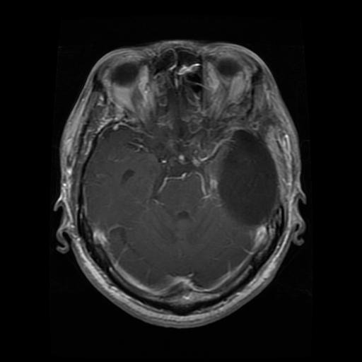
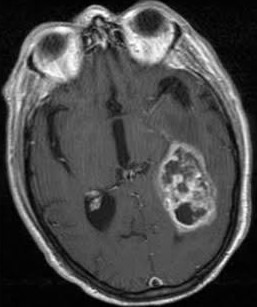
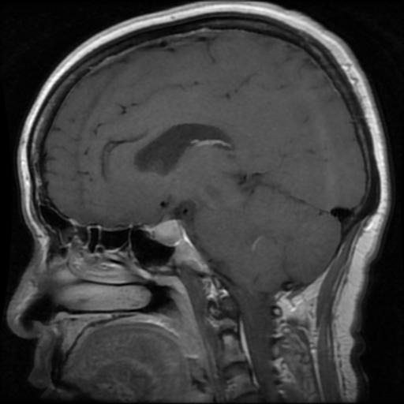
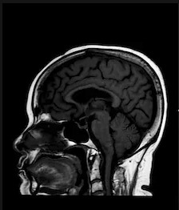

# 🧠 Brain Tumor Detection using Deep Learning

This project is a deep learning-based web application for detecting brain tumors from MRI images. It allows users to upload MRI scans and receive instant predictions through an intuitive web interface.

---

## 🧩 Features

- Upload MRI images of the brain
- Real-time tumor detection using deep learning
- Displays predictions in a simple and clear format
- Organizes uploaded images and predictions in structured folders
- Web interface using Flask
- Supports multiple types of tumors: `Glioma`, `Meningioma`, `Pituitary`, and `No Tumor`

---

## 🖼 Sample MRI Images

| Glioma | Meningioma | Pituitary | No Tumor |
|--------|------------|-----------|----------|
|  |  |  |  |

---

## 🛠 Tech Stack

| Category      | Tools/Libraries                         |
|---------------|------------------------------------------|
| Language      | Python                                  |
| Web Framework | Flask                                   |
| Deep Learning | TensorFlow / Keras                      |
| Frontend      | HTML, CSS (with Jinja Templates)        |
| Deployment    | GitHub / Hugging Face / Render (optional) |

---

## 📂 Folder Structure


## 📂 Folder Structure

- `main.py` – Flask web application (main backend file)
- `models/`
  - `brain_tumour_detection_using_deep_learning.ipynb` – Jupyter Notebook for model training
- `templates/`
  - `index.html` – Frontend web page (HTML template)
- `static/uploads/` – Uploaded MRI images for prediction
- `mri-images/` – Sample MRI test images
- `uploads/` – Additional uploaded files
- `requirements.txt` – List of required Python libraries
- `.gitignore` – To ignore unnecessary files in Git
- `README.md` – Project documentation (this file)


---

## ⚙️ How to Run Locally

```bash
# 1. Clone the repository
git clone https://github.com/AyeshaAndleeb/brain-tumor-detection-ml.git
cd brain-tumor-detection-ml

# 2. Create virtual environment and activate
python -m venv venv
source venv/bin/activate  # For Linux/macOS
venv\Scripts\activate     # For Windows

# 3. Install dependencies
pip install -r requirements.txt

# 4. Run the application
python main.py
